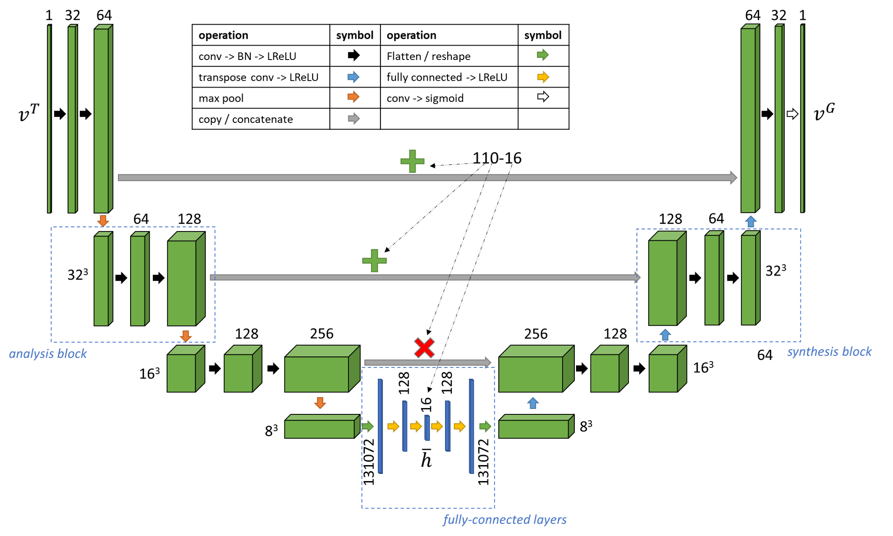
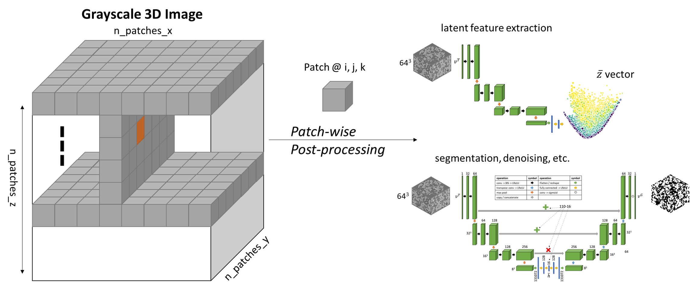

============
TomoEncoders
============

This code (1) trains a convolutional auto-encoder (CAE) against pairs of grayscale and binarized data (2) extracts the latent space of the CAE and projects it to 2D space. For certain configurations of the architecture it is possible to order the clusters based on porosity metrics. More details are in our upcoming paper at IEEE-ICIP 2021. See the jupyter notebooks section for results. Data will be available shortly.

The architecture is defined with synthesis and analysis blocks inspired by the 3D U-net (note the skip connections).  

he encoder-decoder (segmenter or denoiser) is trained by sampling patches of data from the 3D image pairs (grayscale and binarized image) around random coordinates to generate training data. Then, the encoder part is separated, and latent vectors are projected to 2D by PCA. Once trained, patches can be sampled from a given list of coordinates in the grayscale volume to identify morphological similarities. 

Features
--------

* List here 
* the module features

Contribute
----------

* Documentation: https://github.com/aniketkt/TomoEncoders/tree/master/doc
* Issue Tracker: https://github.com/aniketkt/TomoEncoders/docs/issues
* Source Code: https://github.com/aniketkt/TomoEncoders/project

Content
-------

.. toctree::
   :maxdepth: 1

   source/about
   source/install
   source/train
   source/devguide
   source/api
   source/demo
   source/credits
