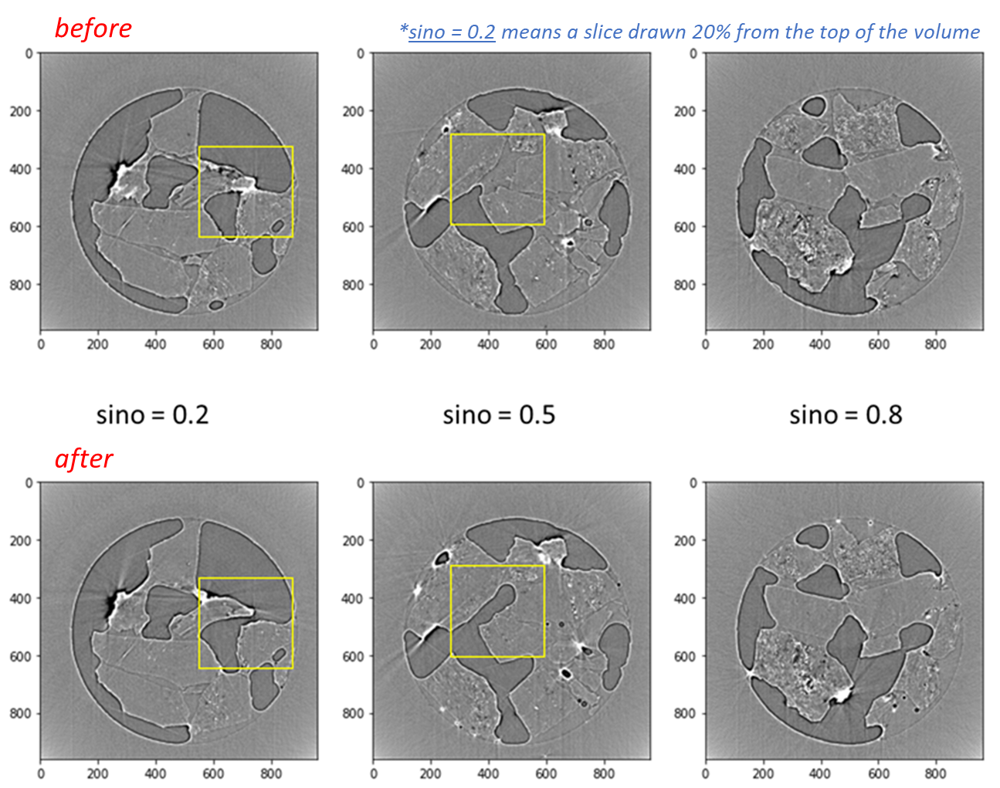

# Coal-ice melting experiment

This experiment was conducted 2-BM of Advanced Photon Source (APS) by Viktor Nikitin. Here, projections were acquired while the sample is continuously spinning (data gathered for over 25 full 360 rotations). There are 3 phases: coal grains, water, and air. As the ice inside the coal melts, the ice produces air bubbles inside the water, thus the amount of air should increase in time, which is evident in the changing interface (see figure). This code (1) trains a convolutional auto-encoder (CAE) on the initial volume (tzero) as a self-supervised denoiser, then it is used to compute latent space of the CAE (16, 32 or 128 dimensional). The Eucledian distance in the embedding space between *before* and *after* volumes is used to define a change metric. The code computes this metric for cubic patches of width 64 pixels, then visualizes this as a point cloud colored by the change metric, indicating which parts of the volume change more than others. The architecture is defined with synthesis and analysis blocks inspired by the 3D U-net (note the skip connections). The encoder-decoder CAE is trained by sampling patches of data from the 3D image pairs (grayscale and binarized image) around random coordinates to generate training data. Once trained, patches are sampled on grid of voxel coordinates in the grayscale volumes.  
  

  

  

atekawade [at] anl [dot] gov
  
